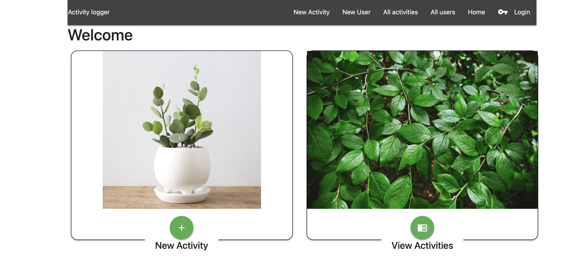
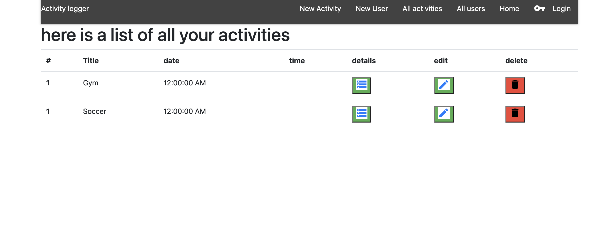

# Activity Tracker 

This is a server side To-do app that allows the user to log in his activities to perform full crud operations using RESTful routing. 

## screenshots

# Technologies
- HTML5
- CSS3
- Java Script
- materialzie CSS
- Node.js
- Express
- Mongoose

# Getting Started

- [Click Here to get Started](https://activity-project-unit.herokuapp.com/)

# Future Enahncements
- the one to many relationship between the user and the list of activities is not working properly as of now 
- allow users to upload images and store it as well in their account.
- add more fields to the form to allow the user more flexibility
    